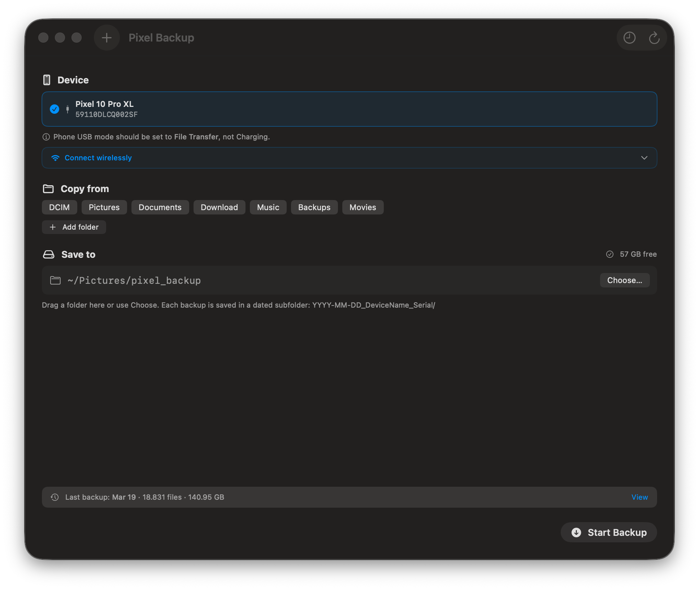

# Pixel Backup

> Resumable, lossless Android-to-macOS media backup — native macOS app + shell script powered by `adb`.

Back up your entire Pixel (or any Android) photo library to your Mac over USB or Wi-Fi. Files are **never altered, renamed, or re-encoded**. Re-running skips already-copied files. Nothing is ever deleted from your Mac.



---

## Features

- **Native macOS app** — SwiftUI window with device picker, folder selection, live progress, speed & ETA, backup history, and system notifications
- **Wireless ADB** — connect over Wi-Fi by entering the device IP; saved addresses auto-reconnect on every launch. Supports Android Wireless Debugging pairing (no USB required at all)
- **Menu bar extra** — monitor and open new backups from the menu bar without keeping a window open
- **Multiple independent windows** — back up a second device simultaneously in a separate window (`⌘N`)
- **Resumable transfers** — re-run at any time; files already on disk are skipped by size match
- **Zero quality loss** — files are pulled byte-for-byte with `adb pull`; no transcoding, no renaming
- **Dated backup folders** — each run lands in `YYYY-MM-DD_DeviceName_Serial/` for easy history browsing
- **ADB auto-recovery** — detects flaky USB, reconnects, and retries per-file up to N times
- **Disk space guard** — checks free space before and during copy; warns and aborts near critical thresholds
- **USB debugging guide** — in-app step-by-step instructions shown when no device is detected
- **Drag-and-drop destination** — drop a folder onto the window to set the backup target
- **Custom folder selection** — toggle built-in folders (DCIM, Pictures, Documents, Download, Music, Backups, Movies) or add any custom Android path
- **Localized** — English, German, Spanish, French
- **Shell script** — full `pixel_backup.sh` included for headless/cron use with all options exposed as environment variables

---

## Requirements

| Requirement | Details |
|---|---|
| macOS | 13 Ventura or later |
| Architecture | Apple Silicon and Intel |
| Swift | 5.9+ (Xcode Command Line Tools) |
| Android | Any device with USB or Wireless debugging enabled |

---

## Quick Start

### macOS App — download (easiest)

Download the latest `PixelBackup-x.x.x.dmg` from the [Releases](../../releases) page, open it, and drag **PixelBackup** to your Applications folder.

> **First launch warning:** if macOS shows _"PixelBackup can't be opened because it is from an unidentified developer"_, right-click the app icon and choose **Open**. You only need to do this once. This prompt disappears entirely once the release is notarized with a Developer ID certificate.

> **Corporate / MDM-managed Mac:** if your employer's IT policy enforces "App Store only", the right-click workaround will not work. Use the shell script instead — it has no installer and requires no trust decisions from macOS.

### macOS App — build from source

```bash
git clone https://github.com/JavanXD/pixel_backup.git
cd pixel_backup/PixelBackupApp
# Download the bundled adb binary (not stored in git)
curl -fsSL -o /tmp/pt.zip https://dl.google.com/android/repository/platform-tools-latest-darwin.zip
unzip -j /tmp/pt.zip platform-tools/adb -d Sources/PixelBackup/Resources/
chmod +x Sources/PixelBackup/Resources/adb
swift run
```

### Shell Script Only

No installer, no Gatekeeper, works on any macOS:

```bash
brew install android-platform-tools
chmod +x pixel_backup.sh
./pixel_backup.sh
```

---

## Output Layout

Each backup run creates a dated subfolder:

```
~/Pictures/pixel_backup/
└── 2026-03-19_Pixel_10_Pro_XL_59110DLCQ002SF/
    ├── DCIM/
    ├── Pictures/
    ├── Download/
    └── .transfer_meta/
        ├── manifest.tsv       # all successfully copied files (cumulative)
        ├── manifest_run.tsv   # files copied in this run only
        ├── failed.tsv         # files that failed after all retries
        └── transfer.log       # full timestamped log
```

Running again on the **same day** resumes into the same folder. A **new date** always creates a new folder, so you get a clean history you can browse by date.

---

## What Gets Copied

Default folders scanned on the device:

| Folder | Contents |
|---|---|
| `DCIM` | Camera photos and videos |
| `Pictures` | Screenshots, saved images |
| `Documents` | Documents and files |
| `Download` | Downloaded files |
| `Music` | Music files |
| `Backups` | App backups |
| `Movies` | Video recordings |

The app lets you toggle any of these and add custom paths (e.g. `/sdcard/WhatsApp/Media`). Hidden files and dot-directories (`.thumbnails`, `.trashed`, `.nomedia`, etc.) are always excluded.

---

## Shell Script Parameters

All parameters are environment variables:

| Variable | Default | Description |
|---|---|---|
| `DEST_ROOT_BASE` | `~/Pictures/pixel_backup` | Base destination directory |
| `DEVICE_SERIAL` | _(empty)_ | Target a specific device serial |
| `DEVICE_SELECTION` | `auto` | `auto` / `all` / `first` |
| `SEPARATE_DEVICE_DIRS` | `1` | `1` = per-device subfolders, `0` = shared root |
| `REMOTE_DIRS_CSV` | _(empty)_ | Colon-separated Android paths to scan |
| `MAX_PULL_ATTEMPTS` | `3` | Per-file retries before marking failed |
| `MAX_ADB_RECOVERY_ATTEMPTS` | `3` | ADB reconnect attempts on unstable connection |
| `ADB_WAIT_SECONDS` | `20` | Seconds to wait for device to become ready |
| `SHOW_RUNTIME_HINTS` | `1` | Print operator hints for lock/USB/auth issues |
| `HEALTHCHECK_INTERVAL_SECONDS` | `30` | Minimum seconds between repeated hint messages |
| `PROGRESS_EVERY_FILES` | `200` | Print progress summary every N files |
| `PRECHECK_FREE_SPACE` | `1` | `0`=off `1`=fast `2`=full estimate |
| `FREE_SPACE_BUFFER_GB` | `10` | Minimum free GB required before starting |
| `RUNTIME_FREE_SPACE_WARN_GB` | `15` | Warn when free space drops below this |
| `RUNTIME_FREE_SPACE_STOP_GB` | `2` | Abort when free space is critically low |

```bash
# Show all options
./pixel_backup.sh --help
```

---

## Architecture

```
pixel-backup/
├── pixel_backup.sh               # Core shell script (works standalone)
├── PixelBackupApp/
│   └── Sources/PixelBackup/
│       ├── PixelBackupApp.swift  # App entry, WindowGroup, menu bar
│       ├── AppDelegate.swift     # NSStatusItem, window rescue, multi-display fix
│       ├── WindowRoot.swift      # Per-window BackupManager owner
│       ├── ContentView.swift     # Root config/progress/summary UI
│       ├── BackupManager.swift   # Orchestrates script execution, log parsing
│       ├── DeviceManager.swift   # adb device polling
│       ├── BackupCoordinator.swift # Shared running-count for menu bar icon
│       ├── NotificationManager.swift # UNUserNotificationCenter
│       ├── LogParser.swift       # Parses structured script output
│       ├── Models.swift          # AndroidDevice, BackupState, RemoteFolder, …
│       ├── L10n.swift            # Type-safe NSLocalizedString helper
│       └── Views/
│           ├── DeviceSectionView.swift      # Device picker, wireless connect, USB guide
│           ├── WirelessPairingSheet.swift   # Android Wireless Debugging pairing flow
│           ├── FolderSelectionView.swift    # Folder toggles + custom folders
│           ├── DestinationPickerView.swift  # Path picker + drag-drop + free space
│           ├── BackupProgressSection.swift  # Live progress bar, speed, ETA, elapsed
│           ├── SummaryCard.swift            # Post-backup summary
│           ├── BackupHistoryView.swift      # Dated backup list (reads manifest.tsv)
│           ├── LogView.swift                # Colour-coded scrolling log
│           ├── HintBannerView.swift         # Dismissible runtime hints
│           └── SetupGuideView.swift         # adb not found onboarding
└── docs/
    └── screenshots/
```

The **macOS app** acts as a UI shell around `pixel_backup.sh`. It resolves the bundled `adb`, passes configuration as environment variables, streams stdout line-by-line, and parses structured log tokens (`PROGRESS`, `COPY`, `OK`, `SKIP`, `FAIL`, `HINT`, …) to drive the UI state machine. Each window owns an independent `BackupManager` so multiple devices can be backed up simultaneously without interference.

---

## Localization

The app ships in four languages. To add a new language:

1. Create `Sources/PixelBackup/<lang>.lproj/Localizable.strings`
2. Copy keys from `en.lproj/Localizable.strings` and translate values
3. Add the language to `defaultLocalization` / `Package.swift` if needed

---

## Troubleshooting

### No device detected (USB)

- Enable **USB debugging** on the phone (Settings → About phone → tap Build number 7 times → Developer options → USB debugging)
- Set USB mode to **File Transfer** (tap the USB notification on the phone)
- Accept the **Allow USB debugging** prompt on the phone
- Try a different cable (charge-only cables won't work)

### No device detected (wireless)

Use the **"Connect wirelessly"** section in the app and enter the phone's IP address (`192.168.1.x`). Two ways to prepare the phone:

**Option A — Wireless Debugging (no USB needed):**
1. Settings → Developer options → **Wireless debugging** → enable
2. Tap **"Pair device with pairing code"** — enter the address and code in the app's pairing sheet
3. After pairing, enter the IP:port shown on the main Wireless debugging screen

**Option B — TCP/IP mode (USB once, then wireless):**
1. Connect USB, then in Terminal: `adb tcpip 5555`
2. Unplug USB — enter the phone's IP address in the app (`192.168.1.x`)

### `Missing command: adb`

```bash
brew install android-platform-tools
```

### Multiple devices and `auto` mode fails

```bash
DEVICE_SERIAL=<serial> ./pixel_backup.sh   # specific device
DEVICE_SELECTION=all ./pixel_backup.sh     # all devices sequentially
```

### Not enough disk space

```bash
FREE_SPACE_BUFFER_GB=25 ./pixel_backup.sh         # require 25 GB headroom
PRECHECK_FREE_SPACE=2 ./pixel_backup.sh            # full estimate before copy
```

---

## Changelog

### Unreleased
- **Wireless ADB** — connect over Wi-Fi, auto-reconnect saved addresses, Android Wireless Debugging pairing sheet
- `Documents` added as a default copy folder
- App icon — custom design bundled as `AppIcon.icns`
- `build.sh` auto-installs to `/Applications` after every build
- Real-time transfer speed (MB/s) and ETA in progress view
- Elapsed time counter and current filename during backup
- Free disk space indicator on destination picker
- Last backup summary strip on config panel
- "Try Again" / "New Backup" button on failed/cancelled state
- `⌘Return` keyboard shortcut to start backup
- History loads from `manifest.tsv` instead of walking files (critical perf fix for large backups)
- History shows "Folder moved or deleted" if a backup folder was removed after history loaded
- Multiple independent windows (`⌘N`) — each window has its own `BackupManager`
- Menu bar `NSStatusItem` replaces SwiftUI `MenuBarExtra` (fixes menu appearing on wrong display)
- `+` toolbar button to open a new window when only one is open
- USB debugging step-by-step guide shown inline when no device is found
- Music and Backups added as default copy folders; custom folder paths via UI
- Drag-and-drop destination folder onto window or picker row
- English, German, Spanish, French localization
- `--help` flag on shell script prints all parameters
- Dated backup folder names (`YYYY-MM-DD_DeviceName_Serial`)
- `sanitize_name()` handles Unicode, emoji, and TCP/IP serials (colons) safely

### 0.1.0 — Initial release
- Core `pixel_backup.sh` with ADB auto-recovery, per-file retries, disk space guard
- Native macOS SwiftUI app with device picker, folder selection, live log view
- Backup history view, completion notifications, menu bar mode

---

## CI / CD

Two GitHub Actions workflows are included:

| Workflow | Trigger | What it does |
|---|---|---|
| **CI** (`.github/workflows/ci.yml`) | Push / PR to `main` | Downloads `adb`, `swift build`, `bash -n` lint |
| **Release** (`.github/workflows/release.yml`) | Push of a `v*` tag | Builds release binary, assembles `.app`, signs, notarizes, creates DMG, publishes GitHub Release |

### Publishing a release

```bash
git tag v1.0.0
git push origin v1.0.0
```

The release workflow automatically:
1. Downloads `adb` from Google's platform-tools
2. Builds a release `.app` bundle
3. Signs with Developer ID (if cert secrets are configured) or falls back to ad-hoc signing
4. Notarizes with Apple (if notarization secrets are configured)
5. Creates a DMG via `create-dmg` (falls back to `hdiutil`)
6. Publishes a GitHub Release with the DMG and `pixel_backup.sh` as downloadable assets
7. Fills release notes from `CHANGELOG.md` automatically

Pre-release tags (e.g. `v1.0.0-beta.1`) are automatically marked as pre-releases on GitHub.

### GitHub Secrets for code signing (optional)

Without these secrets the workflow produces an **ad-hoc signed** DMG — fully functional but users must right-click → Open on first launch to bypass Gatekeeper.

| Secret | Description |
|---|---|
| `DEVELOPER_ID_APP` | `Developer ID Application: Your Name (TEAMID)` |
| `DEVELOPER_ID_CERT_P12` | Base64-encoded `.p12` export of your Developer ID cert |
| `DEVELOPER_ID_CERT_PASSWORD` | Password for the `.p12` file |
| `KEYCHAIN_PASSWORD` | Any password for the temporary CI keychain |
| `APPLE_ID` | Apple ID email used for notarization |
| `NOTARY_TEAM` | 10-character Apple Team ID |
| `NOTARY_PASSWORD` | App-specific password generated at appleid.apple.com |

To encode your `.p12` for the secret:
```bash
base64 -i DeveloperID.p12 | pbcopy   # copies to clipboard
```

---

## Contributing

Contributions are welcome. Please:

1. **Fork** the repository and create a feature branch (`git checkout -b feature/my-improvement`)
2. Keep changes focused — one feature or fix per PR
3. Test with a real Android device if changing anything in `pixel_backup.sh` or `BackupManager.swift`
4. Update `CHANGELOG.md` for user-visible changes
5. Open a **Pull Request** — the CI workflow runs automatically on your PR

### Known gaps / good first issues

- [ ] Optional checksum verification (md5/sha1) after copy
- [ ] Scheduled / automatic backups via `LaunchAgent`

---

## License

MIT — see [LICENSE](LICENSE) for details.

---

## Notes

- Re-running is always safe. Already-copied files are skipped; nothing on your Mac is ever deleted.
- Skip logic validates by **file size**, not checksum. Use `PRECHECK_FREE_SPACE=2` if you want a byte-exact integrity pass.
- The app requires macOS 13+ for `MenuBarExtra` and the multi-window `WindowGroup` API. The shell script runs on any macOS with `bash` 3.2+ and `adb` in `PATH`.
